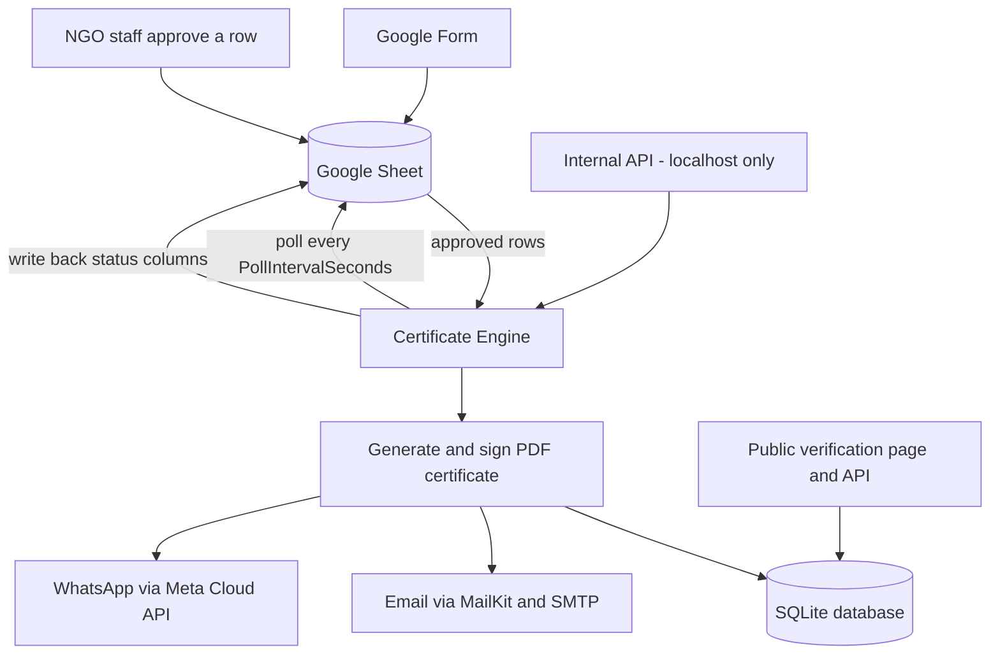

# NGO Certificate Engine

A self-hosted platform that turns approved Google Form submissions into tamper-evident, digitally signed PDF certificates — delivered by email and/or WhatsApp, with a public page anyone can use to verify a certificate is genuine.

## What this is

There is no custom registration or quiz UI to build or maintain: **Google Forms is the intake UI**, and the **linked Google Sheet is the source of truth** for submissions. NGO staff review responses in the Sheet and mark a row `Approved` in the `Status` column. From there, a single ASP.NET Core application — `src/CertificateEngine` — does everything else:

- Polls the Sheet on a timer (via a Google service account) and picks up newly-approved rows.
- Generates a certificate PDF, embeds a QR code linking to the verification page, and cryptographically signs the PDF with the organization's own certificate authority.
- Stores the certificate record, delivery record, and an append-only hash-chained audit entry in a local SQLite database.
- Emails the certificate and/or sends it over WhatsApp, with automatic fallback from WhatsApp to email.
- Writes delivery/certificate status back into the Sheet so staff can see progress without leaving the spreadsheet.
- Serves a public, unauthenticated verification page/API so anyone holding a certificate (or checking one on someone else's behalf) can confirm it's genuine, unmodified, and not revoked.

The whole thing runs as one process — background workers and a small public web API/page, both served by Kestrel — no separate queue, cache, or database server to operate.

## How it works



Certificate signing uses the organization's own offline certificate authority (see the CA tool below and [`docs/signing-key-and-ca.md`](docs/signing-key-and-ca.md)) rather than a paid public CA. Email and WhatsApp are both implementations of the same delivery abstraction, so one can automatically fail over to the other.

## Repository layout

| Path | Contents |
| --- | --- |
| `src/CertificateEngine` | The ASP.NET Core app (workers + public API), targets `net8.0`. |
| `tests/CertificateEngine.Tests` | Automated tests for the app. |
| `tools/CertificateEngine.CaTool` | Offline console tool that generates the organization's own signing certificate authority. |
| `docs/` | Setup guides — Google, email DNS, WhatsApp, signing/CA, hosting. |
| `deploy/systemd` | Production systemd unit. |
| `deploy/caddy` | Production Caddy reverse proxy config. |
| `.github/workflows` | CI. |

## Quickstart

1. **Clone the repository** and make sure you have the .NET 8 SDK installed (`global.json` pins `8.0.100`, roll-forward `latestFeature`):
   ```
   dotnet --version
   ```
2. **Generate your certificate authority** with the CA tool (one-time; see [`docs/signing-key-and-ca.md`](docs/signing-key-and-ca.md) for full details and how to protect the output):
   ```
   dotnet run --project tools/CertificateEngine.CaTool -- init --organization "My NGO" --out data/ca --root-years 20 --signing-years 2
   ```
3. **Set up the Google Cloud service account** and share the target Sheet with it — see [`docs/google-setup.md`](docs/google-setup.md).
4. **Configure the app** — put the settings you need into `appsettings.Production.json` (git-ignored) or set them as environment variables using the `Section__Key` convention (see [Configuration](#configuration) below). At minimum you'll need `Platform`, `GoogleSheets`, and `Signing` filled in; add `Smtp` and/or `WhatsApp` depending on which delivery channels you use.
5. **Run it**:
   ```
   dotnet run --project src/CertificateEngine
   ```
6. **Approve a test submission** in the Sheet (set `Status` to `Approved`), wait for the next poll (or trigger `POST /internal/events/{eventId}/poll-now`), then open `https://<PublicBaseUrl>/verify/{publicId}` for the resulting certificate to confirm the verification page renders and shows a valid signature.

For production deployment (systemd + Caddy on a small Linux VM), see [`docs/hosting.md`](docs/hosting.md).

## Configuration

Configuration binds from `appsettings.json` (and `appsettings.Production.json`, which is git-ignored) using standard ASP.NET Core configuration. Any setting can be overridden with an environment variable using a double underscore in place of `:` — for example, the environment variable `Smtp__Password=hunter2` sets the configuration key `Smtp:Password`. Prefer environment variables (or the systemd `EnvironmentFile` described in [`docs/hosting.md`](docs/hosting.md)) for secrets, and keep them out of `appsettings.*.json`.

### `Platform`

| Key | Type / constraints | Default | Notes |
| --- | --- | --- | --- |
| `OrganizationName` | string | — | Shown on certificates and the verification page. |
| `PublicBaseUrl` | absolute **https** URL | — | e.g. `https://verify.yourdomain.org`. Used to build verification links and QR codes. |
| `DataDirectory` | string | `data` | Holds the SQLite database and signed PDF artifacts. **Back this up** — see [`docs/hosting.md`](docs/hosting.md). |
| `InternalApiKey` | string, ≥ 32 chars | — | Shared secret for the internal API (`X-Api-Key` header). Generate with, e.g., `openssl rand -base64 32`. |
| `PollIntervalSeconds` | int, 15–3600 | `90` | How often each configured event's Sheet is polled for newly-approved rows. |
| `DeliveryPollSeconds` | int | `5` | How often the delivery queue (email/WhatsApp send + retries) is drained. |
| `MaxDeliveryAttempts` | int, 1–20 | `5` | Attempts per delivery before it's marked permanently failed. |
| `Events` | array of event entries | `[]` | One entry per NGO event / Google Form. See below. |

### `Platform:Events[]`

Each entry configures one Google Form/Sheet pairing:

| Key | Default | Notes |
| --- | --- | --- |
| `EventId` | — | Stable identifier, used in URLs like `/internal/events/{eventId}/poll-now`. |
| `EventName` | — | Human-readable name, shown on certificates. |
| `SpreadsheetId` | — | The ID from the Sheet's URL. |
| `SheetName` | `"Form Responses 1"` | Tab name inside the spreadsheet. |
| `Range` | `"A:ZZ"` | A1-notation range to read. |
| `TemplateId` | `"default"` | Which certificate template to render. |
| `SourceIdColumn` | `"Timestamp"` | Used as the natural unique key per submission (Google Forms always fills this in). |
| `NameColumn` | `"Full Name"` | |
| `EmailColumn` | `"Email Address"` | |
| `PhoneColumn` | `"Phone Number"` | |
| `ApprovalColumn` | `"Status"` | Staff set this to `ApprovalValue` to approve a row. |
| `ApprovalValue` | `"Approved"` | |
| `ScoreColumn` | *(none)* | Optional — for Google Forms quiz scoring. |
| `MinimumScore` | *(none)* | Optional — gate certificate issuance on `ScoreColumn`. |
| `CertificateStatusColumn` | `"Certificate Status"` | Written back by the engine. |
| `VerificationIdColumn` | `"Verification ID"` | Written back by the engine (the certificate's `publicId`). |
| `ProcessedAtColumn` | `"Certificate Processed At"` | Written back by the engine (UTC timestamp). |
| `SendEmail` | `true` | |
| `SendWhatsApp` | `false` | |
| `EmailFallbackForWhatsApp` | `true` | If WhatsApp delivery permanently fails, email is queued automatically. |

Column names are configurable per event — rename headers in the Sheet as long as you update the matching config. See [`docs/google-setup.md`](docs/google-setup.md) for the full walkthrough, including quiz scoring.

### `GoogleSheets`

| Key | Default | Notes |
| --- | --- | --- |
| `ApplicationName` | — | Sent to the Google API as the calling application name. |
| `ServiceAccountJson` | *(none)* | Raw service-account JSON as a string (useful with secret managers). |
| `ServiceAccountJsonEnvironmentVariable` | `GOOGLE_SERVICE_ACCOUNT_JSON` | Env var holding the raw JSON, checked if `ServiceAccountJson` isn't set. |
| `ServiceAccountJsonPath` | *(none)* | Path to the service-account JSON file. |
| `ServiceAccountPathEnvironmentVariable` | `GOOGLE_APPLICATION_CREDENTIALS` | Env var holding a file path, checked last. |

Credentials are resolved in the order listed above. Only the Sheets API scope is required. See [`docs/google-setup.md`](docs/google-setup.md).

### `Smtp`

| Key | Default | Notes |
| --- | --- | --- |
| `Enabled` | — | |
| `Host` | — | |
| `Port` | `587` | |
| `UseStartTls` | `true` | |
| `Username` | — | |
| `Password` | — | Set via environment variable, not `appsettings.json`. |
| `FromAddress` | — | |
| `FromName` | — | |

See [`docs/email-dns.md`](docs/email-dns.md) for the DNS records a self-hosted relay needs to land in inboxes.

### `WhatsApp`

| Key | Default | Notes |
| --- | --- | --- |
| `Enabled` | — | |
| `GraphApiVersion` | `v23.0` | |
| `PhoneNumberId` | — | |
| `AccessToken` | — | Set via environment variable, not `appsettings.json`. |
| `TemplateName` | `certificate_delivery` | Must be a pre-approved Meta message template. |
| `TemplateLanguage` | `en` | Must match the template's approved language exactly. |

See [`docs/whatsapp-setup.md`](docs/whatsapp-setup.md) for Meta Business verification and template approval.

### `Signing`

| Key | Default | Notes |
| --- | --- | --- |
| `Enabled` | `true` | |
| `PfxPath` | — | Path to `signing.pfx` produced by the CA tool. |
| `PfxPassword` | — | Set via environment variable, not `appsettings.json`. |
| `TrustedRootPath` | — | Path to `root-ca.pem`; used by the verification page to confirm the signer chains to our own root. |
| `TimestampServerUrl` | *(none)*, optional, must be absolute https | RFC 3161 timestamp authority for the signature. |
| `Reason` | — | Shown in the PDF signature metadata. |
| `Location` | — | Shown in the PDF signature metadata. |
| `ContactInfo` | — | Shown in the PDF signature metadata. |

See [`docs/signing-key-and-ca.md`](docs/signing-key-and-ca.md) for how to generate and protect these files.

### Example `appsettings.Production.json`

Secrets below are placeholders — set the real values as environment variables instead of committing them.

```json
{
  "Platform": {
    "OrganizationName": "My NGO",
    "PublicBaseUrl": "https://verify.yourdomain.org",
    "DataDirectory": "data",
    "PollIntervalSeconds": 90,
    "DeliveryPollSeconds": 5,
    "MaxDeliveryAttempts": 5,
    "Events": [
      {
        "EventId": "2026-volunteer-training",
        "EventName": "2026 Volunteer Training",
        "SpreadsheetId": "1AbCdEfGhIjKlMnOpQrStUvWxYz",
        "SheetName": "Form Responses 1",
        "SendEmail": true,
        "SendWhatsApp": false
      }
    ]
  },
  "GoogleSheets": {
    "ApplicationName": "My NGO Certificate Engine"
  },
  "Smtp": {
    "Enabled": true,
    "Host": "mail.yourdomain.org",
    "Port": 587,
    "UseStartTls": true,
    "FromAddress": "certificates@yourdomain.org",
    "FromName": "My NGO"
  },
  "WhatsApp": {
    "Enabled": false
  },
  "Signing": {
    "Enabled": true,
    "PfxPath": "data/ca/signing.pfx",
    "TrustedRootPath": "data/ca/root-ca.pem",
    "Reason": "Certificate issuance",
    "Location": "My NGO",
    "ContactInfo": "certificates@yourdomain.org"
  }
}
```

## Public verification

No authentication required:

| Endpoint | Description |
| --- | --- |
| `GET /verify/{publicId}` | HTML verification page for humans. |
| `GET /api/verify/{publicId}` | JSON: `publicId`, `status` (`Valid`, `Revoked`, `NotFound`, `SignatureInvalid`), `certificateNumber`, `participantName`, `eventName`, `issuedAtUtc`, `revokedAtUtc`, `revocationReason`, `signatureValid`, `signerSubject`, `fileSha256`. |

Every certificate PDF has a QR code that encodes its `/verify/{publicId}` URL.

## Internal API

Requires an `X-Api-Key: <Platform:InternalApiKey>` header, and is meant to be reachable only from `localhost` or trusted automation — **never expose it to the public internet** (see [`docs/hosting.md`](docs/hosting.md) for how the reference Caddy config enforces this).

| Endpoint | Description |
| --- | --- |
| `GET /internal/health` | Health check. |
| `POST /internal/events/{eventId}/poll-now` | Trigger an immediate poll-and-issue cycle for one event instead of waiting for the next scheduled poll. |
| `POST /internal/certificates/{publicId}/revoke` | Body: `{ "reason": "..." }`. Revokes a certificate. |
| `GET /internal/audit/verify` | Re-validates the local hash-chained audit log end-to-end. |

## Extensibility

A couple of integrations are deliberately isolated behind interfaces so they can be swapped out later without touching the rest of the app:

- **WhatsApp** delivery sits behind `IDeliveryChannel` — the same abstraction email uses — so another channel (e.g. SMS) could be added, or WhatsApp swapped for a different provider, without changing the delivery pipeline or the automatic email fallback logic.
- **Google Sheets** access sits behind `ISheetSource` — so the "source of truth" could later be swapped for something other than Google Sheets without touching certificate generation, delivery, or verification.

## Documentation

- [`docs/google-setup.md`](docs/google-setup.md) — GCP project, service account, Sheets sharing, Form/Sheet column conventions, quiz scoring, optional Apps Script push.
- [`docs/email-dns.md`](docs/email-dns.md) — SPF/DKIM/DMARC/PTR for a self-hosted SMTP relay.
- [`docs/whatsapp-setup.md`](docs/whatsapp-setup.md) — Meta Business verification, app setup, template approval, costs.
- [`docs/signing-key-and-ca.md`](docs/signing-key-and-ca.md) — running the CA tool, protecting the keys, why Adobe won't show its own checkmark.
- [`docs/hosting.md`](docs/hosting.md) — VM setup, systemd, Caddy, firewall, backups.

## Deployment

Production deployment is a single small Linux VM running the app under systemd behind Caddy. See [`docs/hosting.md`](docs/hosting.md), [`deploy/systemd/certificate-engine.service`](deploy/systemd/certificate-engine.service), and [`deploy/caddy/Caddyfile`](deploy/caddy/Caddyfile).
