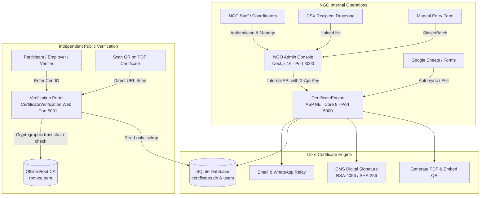

# NGO Certificate Operations & Verification Platform

A production-ready, self-hosted certificate issuance and cryptographic verification system designed specifically for NGOs, training cohorts, and educational non-profits.

The platform provides **two streamlined interfaces**:
1. **NGO Admin Operations Console** (`http://localhost:3000`): A private, authenticated management portal for staff to create cohorts, issue certificates (via manual input, CSV upload, or automated Google Sheets polling), download signed PDFs, and manage revocations.
2. **Independent Verification Portal** (`http://localhost:5001`): A public, fast, and tamper-evident portal where employers, partners, and participants verify certificates via QR code or certificate ID against the organization's offline Root Certificate Authority.

---

## Architecture Overview



---

## 1. NGO Admin Operations Console (`Port 3000`)

The Admin Console is password-protected and accessible only to authorized NGO coordinators and administrators.

### Core Staff Workflows

#### 1. Cohort & Event Management (`/events`)
- Track all ongoing and completed training cohorts.
- View real-time progress bars (`issuedCount / totalCount`).
- Create new cohorts with customized certificate design templates (`/events/new`).

#### 2. Recipient Credential Issuance (`/events/{id}/issue`)
- **Manual Input**: Add recipient names, emails, and phone numbers directly.
- **CSV Upload**: Drop any standard spreadsheet CSV with `Name` and `Email` columns. The parser automatically validates recipient rows and enables one-click batch issuance.
- **Google Sheets Sync**: Connect Google Form responses for automated background polling or trigger immediate synchronization with the **Sync Responses** button.

#### 3. Complete Certificate Registry (`/certificates`)
- Comprehensive audit log of every credential ever issued.
- Live keyword search by recipient name, email, or certificate number.
- Filter by status (`All`, `Issued`, `Revoked`).
- **Direct PDF Download**: Instantly download the cryptographically signed certificate PDF.
- **Verify**: One-click link to open the certificate in the independent verification portal.
- **Auditable Revocation**: Revoke any certificate with a mandatory reason (e.g. "Issued in error" or "Requirements not met"). Revocations are reflected immediately across all verification checkpoints.

---

## 2. Independent Public Verification Portal (`Port 5001`)

The Verification Portal operates completely independently of the administrative console:
- **Zero-Login Required**: Anyone holding a certificate can verify it instantly without an account.
- **Tamper-Evident Security**: Evaluates the attached `.p7s` Cryptographic Message Syntax (CMS) digital signature and checks the SHA-256 hash of the PDF artifact.
- **Custom Root CA Trust**: Validates the cryptographic chain against the organization's offline Root CA (`data/ca/root-ca.pem`).
- **Real-Time Revocation Checks**: If a certificate has been revoked by an administrator, the verification badge clearly displays **Revoked** alongside the official revocation timestamp and reason.

---

## Quickstart (Local Development)

### Prerequisites
- [.NET 8.0 SDK](https://dotnet.microsoft.com/download/dotnet/8.0)
- [Node.js 18+](https://nodejs.org) and `pnpm` (or `npx pnpm`)
- SQLite3

### 1. Initial Setup & CA Initialization
Generate the organization's root certificate authority and signing keys:
```bash
dotnet run --project tools/CertificateEngine.CaTool -- init \
  --organization "Your NGO Name" \
  --out data/ca \
  --root-years 20 \
  --signing-years 2
```
*Note: This creates `data/ca/root-ca.pem`, `data/ca/root-ca.pfx`, and `data/ca/signing.pfx`. Keep `root-ca.pfx` secure and move it to cold storage for production.*

### 2. Configure Secrets & Environment
Set up `secrets.env` for the backend and `.env.local` for the Next.js frontend:
```bash
# Backend secrets
export CA_SIGNING_PASSWORD="<Your-Signing-Password>"
export Signing__PfxPassword="<Your-Signing-Password>"
export Platform__InternalApiKey="local-testing-key-change-before-production-2026"

# Frontend config (.env.local)
ENGINE_URL=http://localhost:5000
ENGINE_API_KEY=local-testing-key-change-before-production-2026
VERIFICATION_URL=http://localhost:5001
NEXT_PUBLIC_VERIFICATION_URL=http://localhost:5001
```

### 3. Run the Platform

Start all three services (in separate terminals or as systemd/docker services):

```bash
# 1. Start Core Backend Engine (Port 5000)
env $(grep -v '^#' secrets.env | xargs) dotnet run --project src/CertificateEngine --urls "http://localhost:5000"

# 2. Start Public Verification Portal (Port 5001)
dotnet run --project src/CertificateVerification.Web --urls "http://localhost:5001"

# 3. Start NGO Admin Operations Console (Port 3000)
npx pnpm dev
```

Default administrative account for testing:
- **Email**: `admin@credentia.local`
- **Password**: `Password123!`

---

## Running Automated Tests

Run the full automated test suite covering PBKDF2 hashing, user security, event aggregation, and certificate queries:
```bash
dotnet test CertificatePlatform.sln
```

Verify Next.js frontend production build:
```bash
npx pnpm build
```

---

## Production Deployment & Operational Documentation

Detailed step-by-step guides for production deployment and external integrations:

1. [**Google Forms & Sheets Setup**](docs/google-setup.md) — Google Cloud service accounts, permission sharing, and sheet column mappings.
2. [**Email Delivery & DNS Deliverability**](docs/email-dns.md) — SPF, DKIM milters, DMARC, and PTR setup for 100% inbox delivery.
3. [**WhatsApp Delivery (Meta Cloud API)**](docs/whatsapp-setup.md) — Meta Business verification, permanent system tokens, and message template approval.
4. [**Signing Key & CA Cryptography**](docs/signing-key-and-ca.md) — Root CA lifecycle, key protection, and cold storage best practices.
5. [**Production Hosting & Hardening**](docs/hosting.md) — Systemd service sandbox, Caddy reverse proxy, TLS, firewall, and encrypted SQLite backups.
